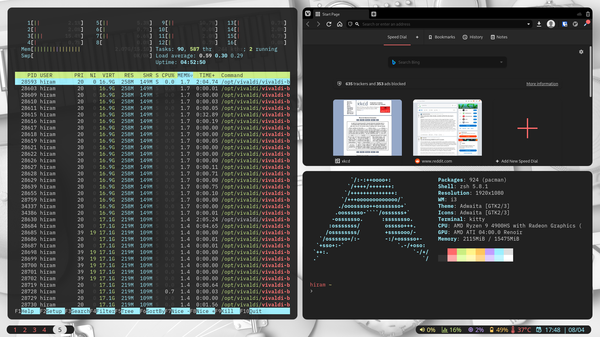
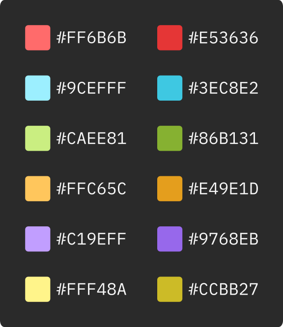
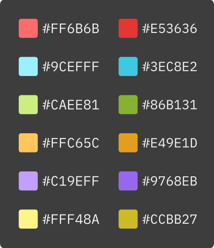

# Hiram's Dotfiles
I spend a lot of time in front of my computer. Like, *a lot* a lot. As such,
it is of great importance to me that my working environment is **exactly** how I
want it. This is what inspired me to create this. 

# Included configuration

## i3-gaps / picom / flashfocus

i3 is the window manager I use. It has most of the features I need, and the addition
of gaps improves the look of the window manager. In order to get rounded corners, 
I use the picom compositor to provide transparency support. I eliminated titlebars
in order to give windows a more aesthetically pleasing look. I also removed bordes for 
the same reason. In order to know what window I have moved my focus to, I use 
flashfocus to reduce transparency of a window when focus is moved to it.

# Tenets
These dotfiles were designed with two core ideas in mind: simplicity and consistency.  

All of the files have a common design architecture, with the objective of being as
consistent as possible across all the UIs of the software I use. Global definitions
are used whenever possible, mainly via environment variables.

I try to depend on as few external dependencies as possible. No zsh plugin / theme 
manager, no multiplexer, use simple, local scripts if possible.

# The Color System

The colors presented above are all of the colors used within all of the themes for 
the software I use. They are inspired by the Monokai colorscheme, originally 
designed in 2006. The colorscheme is a lighter, less saturated version of the original, 
with a black and white scale to fit nicely with the colors, as well as "darker" 
versions of the colors to match.

Colors are used primarily to highlight specific information about something. The 
light colors are the primary ones used. These are used to highlight syntax in Neovim, 
differentiate between parts of a UI, etc. This is mainly achieved through changing 
the color of text. Changing the background color of a text is only used for something
*exceptional*. This means errors, annotations, search results, etc. 

The darker versions of the colors are used sparingly. Their main use is to serve as
the secondary versions of the colors withing my terminal emulator. However, they 
can also be used to highlight something specially important, where other colors are
already being used and needs something that provides more emphasis.

The grayscale colors are used to provide backgrounds for much of my UIs. Generally, 
only the lightest and darkest shades are used to color text. The others are used to 
help provide contrast between parts of UIs, such as the cursor position.

The colorscheme is defined as follows:

